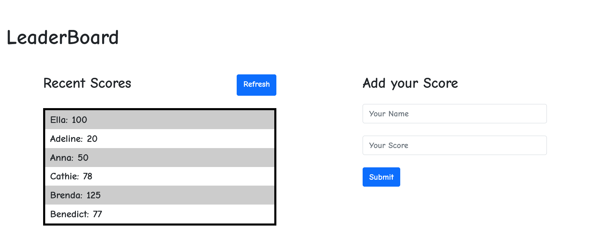

## LeaderBoard

### Milestone 1:
- Setup webpack
- Write plain HTML markup with minimum styling
- Import and export JavaScript modules.

## Built With

- HTML, CSS & JS
- Visual Studio Code
- Webpack
- Linters

## Set up locally

- Open your terminal and run the following command: git clone https://github.com/Cathella/leaderBoard.git
- Run the command "npm install"
- Run the command "npm run build"
- Run the command "npm run start"

Once you completed this steps you should see the app running at: http://localhost:8080/ in your browser.

## Author 👤

👤 **Nakitto Catherine**

- GitHub: [@githubhandle](https://github.com/Cathella)
- Twitter: [@twitterhandle](https://twitter.com/cathella9)
- LinkedIn: [LinkedIn](https://www.linkedin.com/in/nakitto-catherine-2020/)

## 🤝 Contributing

Contributions, issues, and feature requests are welcome!

Feel free to check the [issues page](https://github.com/Cathella//issues)

## Show your support

Give a ⭐️ if you like this project!

## Acknowledgments

- Hat tip to anyone whose code was used
- Inspiration
- etc